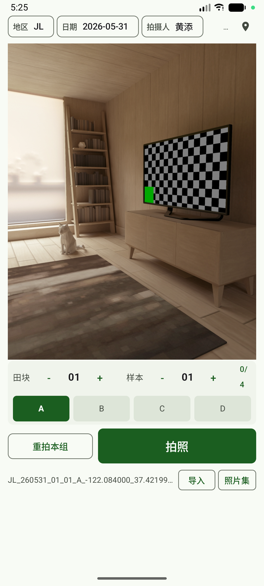
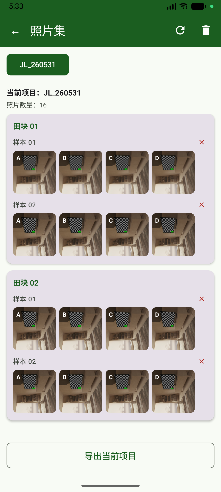

# EasyCamera 📸

一款专为田间采样场景设计的 Android 拍照记录应用。支持田块/样本编码管理、连拍分组、照片预览与导出，配合 GPS 定位与日期信息生成规范的文件与元数据。

> **开发环境**：Android Studio + Kotlin + Jetpack Compose + CameraX

---

## 功能概览

| 功能 | 说明 |
|------|------|
| **相机拍照** | CameraX 实现，4:3 全分辨率输出，无裁切 |
| **照片方向修正** | 自动将拍摄照片统一为横向（长>高），预览与保存一致 |
| **田块/样本编码** | 支持递增/递减，手动编辑，自动锁定防重复 |
| **多角度连拍** | 预设 A/B/C/D 四个角度，一键切换，同编码下连拍归档 |
| **GPS 定位** | 自动获取当前位置，支持手动刷新 |
| **日期/地区/操作员** | 可配置的会话信息，日期选择器默认当日 |
| **照片集管理** | 按项目分组浏览，支持单张/整组删除 |
| **项目导出** | 导出为 ZIP 压缩包，含照片与 CSV 元数据 |
| **项目导入** | 导入已有 ZIP 项目，恢复数据 |
| **强制竖屏** | 锁定纵向显示，不受重力感应影响 |
| **浅色主题** | 强制浅色模式，深绿色主题配色 |

---

## 截图

> 请将截图文件放置于 `screenshots/` 目录下，建议命名如下：

```
screenshots/
├── main_camera.png          # 主界面 - 相机预览
├── code_angle_bar.png       # 田块/样本 + 角度选择栏
├── photo_captured.png       # 拍照后预览定格
├── gallery_main.png         # 照片集主界面
├── gallery_detail.png       # 照片集详情/大图
├── export_import.png        # 导出/导入功能
```

<!-- 示例（待替换为真实截图）：

-->

---

## 技术栈

| 层面 | 技术 |
|------|------|
| UI 框架 | Jetpack Compose (Material 3) |
| 相机 | CameraX (Preview + ImageCapture) |
| 图片加载 | Coil (Compose) |
| 图片处理 | 原生 Bitmap / EXIF 操作 |
| 导航 | Compose 状态驱动 (无 Navigation 组件) |
| 数据持久化 | JSON 文件 (项目级元数据) |
| 定位 | Android Location API |
| 异步 | Kotlin Coroutines + Flow |
| 构建 | Gradle KTS + Version Catalog |

---

## 项目结构

```
app/src/main/java/com/example/easycamera/
├── MainActivity.kt                 # 主界面 + 拍照交互
├── camera/
│   └── PhotoCaptureManager.kt      # CameraX 预览/拍照管理
├── ui/
│   ├── CaptureViewModel.kt         # 主界面 ViewModel
│   ├── theme/
│   │   ├── Color.kt                # 深绿色主题色
│   │   ├── Theme.kt                # 主题配置（强制浅色）
│   │   └── Type.kt                 # 字体排版
│   └── gallery/
│       ├── PhotoGalleryScreen.kt   # 照片集界面
│       └── PhotoGalleryViewModel.kt# 照片集 ViewModel
├── data/
│   ├── model/                      # 数据模型
│   │   ├── CaptureSessionConfig.kt # 会话配置（地区/日期等）
│   │   ├── CaptureState.kt         # 拍照状态机
│   │   ├── CaptureMetadata.kt      # 单张照片元数据
│   │   ├── CapturedPhoto.kt        # 已拍照片信息
│   │   ├── CaptureProject.kt       # 项目结构
│   │   └── LocationInfo.kt         # 定位信息
│   ├── repository/
│   │   ├── MetadataRepository.kt   # 元数据读写
│   │   └── PhotoGalleryRepository.kt # 照片集数据
│   ├── file/
│   │   ├── FileNameGenerator.kt    # 文件名生成规则
│   │   ├── FileNameParser.kt       # 文件名解析
│   │   └── CsvUtils.kt             # CSV 导出工具
│   ├── export/
│   │   └── ProjectExportManager.kt # ZIP 项目导出
│   ├── imports/
│   │   └── ProjectImportManager.kt # ZIP 项目导入
│   └── location/
│       └── LocationProvider.kt     # GPS 定位服务
├── domain/
│   └── CaptureCodeManager.kt       # 编码规则（田块/样本）
└── util/
    └── ImageRotationUtils.kt       # EXIF 方向修正
```

---

## 使用流程

### 1. 启动与授权

首次打开应用会请求**相机**和**定位**权限。授权后进入主界面：


### 2. 配置会话信息

顶部信息栏可设置：
- **地区** — 下拉选择或输入
- **日期** — 点击打开日期选择器，默认当日
- **操作员** — 自定义文本
- **定位** — 自动获取当前位置，可手动刷新


### 3. 设置田块/样本编码

中间栏使用 `+` / `-` 按钮调整田块（Field）和样本（Sample）编码，支持点击编码数字直接编辑。


### 4. 选择角度与拍照

- 点击 **A/B/C/D** 切换拍摄角度
- 点击 **拍照** 按钮拍摄当前编码+角度的照片
- 每个编码下的 4 个角度拍完后自动弹出确认组对话框
- **重拍本组** 可清空当前编码所有照片重新拍摄


### 5. 照片方向修正

拍摄完成后，系统自动根据照片的像素尺寸判断方向：
- 如果照片高度 > 宽度（竖拍），自动逆时针旋转 90° 保存为横向
- 预览框中显示与保存完全一致的内容，无裁切

### 6. 照片集管理

点击底部 **照片集** 进入管理界面：



- 按项目（地区_日期）分组展示
- 展开项目查看照片缩略图
- 点击缩略图查看大图
- 支持单张删除或删除整个项目
- **导出当前项目** → 打包为 ZIP（含照片 + CSV 元数据）

### 7. 项目导出格式

导出 ZIP 内部结构：

```
项目_地区_日期.zip
├── images/
│   ├── 20240101_093000_北京_A01_01_A.jpg
│   ├── 20240101_093500_北京_A01_01_B.jpg
│   └── ...
└── metadata.csv
```

CSV 包含每张照片的时间戳、田块、样本、角度、GPS 坐标、地区、日期、操作员等信息。

### 8. 项目导入

在照片集界面点击 **导入**，选择 ZIP 文件即可恢复项目数据与照片。

---

## 构建与运行

```bash
# 克隆仓库
git clone git@github.com:CyanKirin99/EasyCamera.git

# 使用 Android Studio 打开项目根目录
# 等待 Gradle 同步完成后，连接设备或启动模拟器

# 或命令行构建
./gradlew assembleDebug

# APK 输出位置
app/build/outputs/apk/debug/app-debug.apk
```

### 签名构建（发布版）

项目根目录下 `keystore/easycamera_release.jks` 为发布签名文件（**请勿提交至公开仓库**，已在 `.gitignore` 中排除）。

```bash
./gradlew assembleRelease
```

---

## 设计决策

### 为什么使用 4:3 而非 16:9？

相机传感器原生比例多为 4:3，使用 4:3 可充分利用传感器全分辨率而不裁切，获取更高的图像质量。

### 为什么强制竖屏 + 浅色模式？

田间采样场景中用户通常单手持机操作，竖屏更符合使用习惯。浅色模式在户外强光下比深色模式具有更好的可读性。

### 照片方向处理逻辑

不同的 Android 设备在拍照时输出的 EXIF 方向标签不一致。本项目通过检查照片的实际像素尺寸（而非依赖 EXIF 标签）来决定是否需要旋转，确保在所有设备上最终保存的照片均为横向（长边 > 短边）。

---

## 使用的开源库

| 库 | 用途 |
|----|------|
| [CameraX](https://developer.android.com/training/camerax) | 相机预览与拍照 |
| [Jetpack Compose](https://developer.android.com/jetpack/compose) | 声明式 UI |
| [Material 3](https://m3.material.io/) | 设计系统 |
| [Coil](https://coil-kt.github.io/coil/) | 异步图片加载 |
| [Kotlin Coroutines](https://kotlinlang.org/docs/coroutines-overview.html) | 异步编程 |

---

## License

Apache 2.0 License